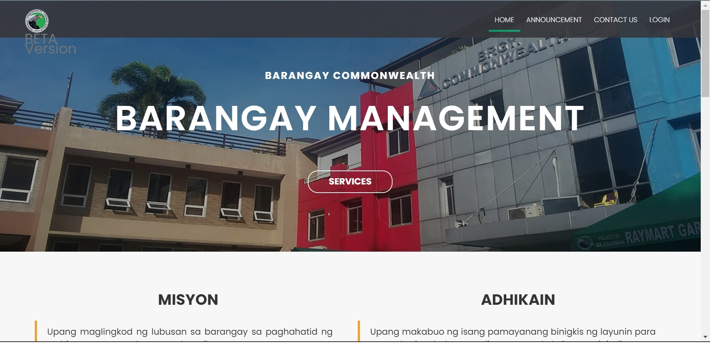
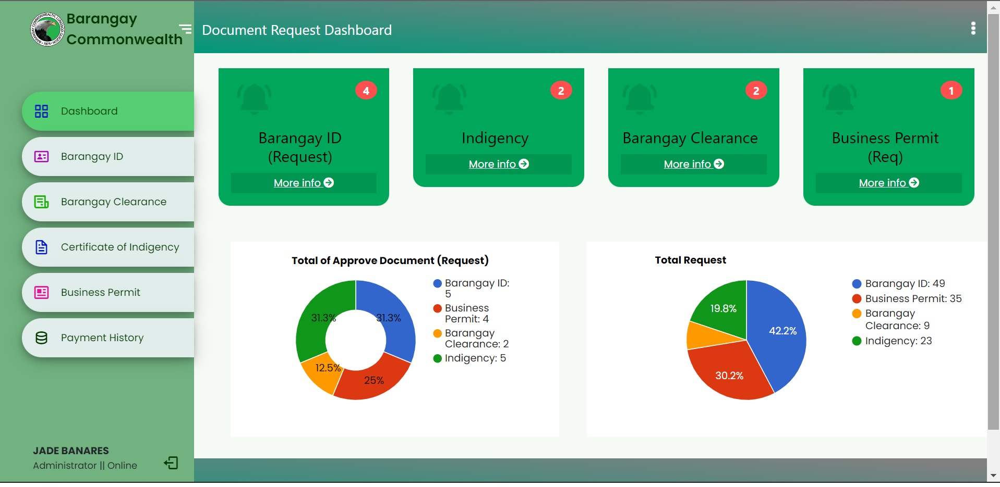
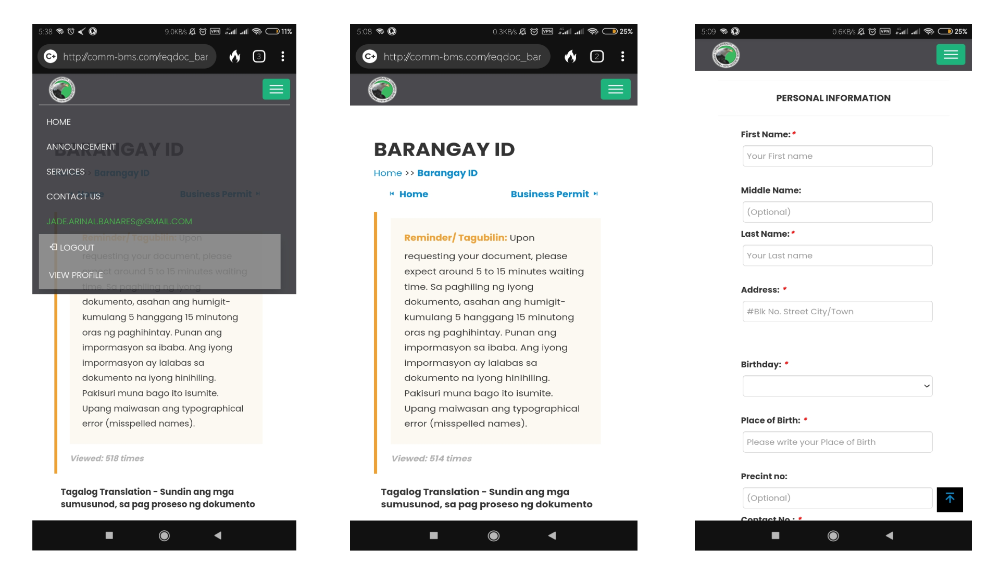
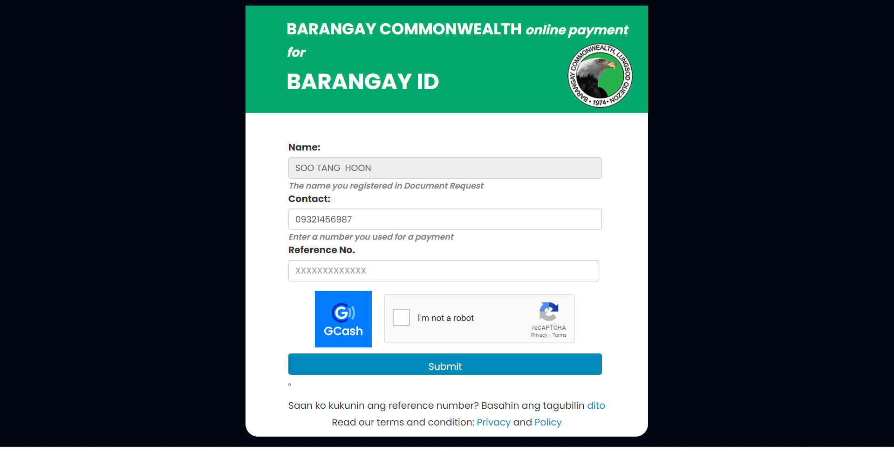

# Barangay Management System for Commonwealth

## Table of contents

- [Overview](#overview)
  - [The Objectives](#the-objectives)
  - [Screenshot](#screenshot)
  - [Links](#links)
- [My process](#my-process)
  - [Built with](#built-with)
  - [Continued development](#continued-development)
  - [Useful resources](#useful-resources)
- [Author](#author)
- [Acknowledgments](#acknowledgments)

## Overview

### The Objectives

Should be able to:

- Create a Web Pages for Resident and Barangay Employees
- View the optimal layout for the content depending on their device's screen size
- See hover states for all interactive elements on the page
- Create a page that handle online payment for Resident using (Reference ID: GCash/Paymaya)
- Create a graph that shows the data
- Create a registration and login for both users
- Others...

### Screenshot

### Links

- Live Site URL: [BMS](http://comm-bms.com/)

## The process

### Built with

- Agile Process
- Semantic HTML5 markup
- CSS custom properties
- Flexbox
- CSS Grid
- Desktop First Workflow
- JavaScript
- PHP
- Bootstrap

### Continued development

Trying to enhance UX/UI experience with by simply customizing each design using Figma and Adobe Illustrator. 

### Useful resources

- [YouTube](https://www.youtube.com) - Great tool to expand your knowledge. There's a lot of free resources. Outhere
- [Stacksoverflow](https://stackoverflow.com/) - Great tool for debugging by simply asking for a help especially for Backend programming. 

## Collaborators/ Programmers

- Ms. Cajucom (System Analyst/Programmer)
- Mr. Miñoza (Programmer)
- Mr. Kenchie (Programmer)

## Acknowledgment

I deeply acknowledge my colleagues who worked with this project. Those sleepless night of working just to finish the project on time, in order to pass the requirement in Capstone Subject. Applause!
